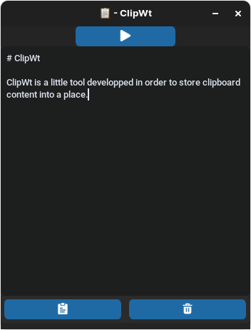

<center>

</center>

# ClipWt

ClipWt is a little tool developped in order to store clipboard content into a place.

<center>

</center>

### Launch

```bash
clipwt
```

## 🔢 Versioning

We use [SemVer](http://semver.org/) for versioning. For the versions available, see the [tags on this repository](https://github.com/Ni-g-3l/clipwt/tags).

## 🤹 Authors / Contributers / Attributions

* **Nig3l** - *Main Developer* - [Github](https://github.com/Ni-g-3l/)

See also the list of [contributors](https://github.com/Ni-g-3l/clipwt/contributors) who participated in this project.

## 📃 License

This project is licensed under the MIT License - see the [LICENSE.md](LICENSE) file for details.

Individiual licensing arrangements can be made if this is an issue for your project - Contact Me at [LinkedIn](https://www.linkedin.com/in/maxime-cots) to discuss.

## 👏 Acknowledgments

* **CustomTktinter** - [Github](https://github.com/TomSchimansky/CustomTkinter)
* **Clipboard Icon** - *Created by Freepik* - [Flaticon](https://www.flaticon.com/free-icons/clipboard")
* **Billie Thompson** - *README & Contribution Templates* - [PurpleBooth](https://github.com/PurpleBooth)